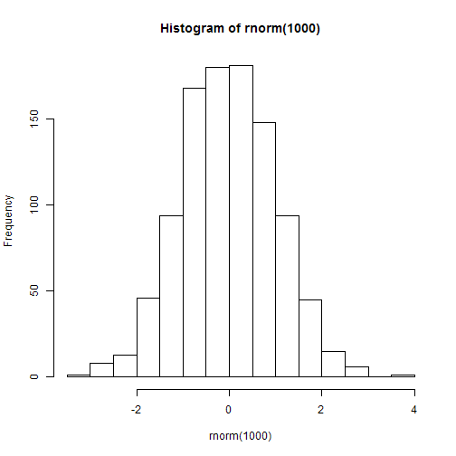

Eric's example
========================================================

Minimal example taken from Yihui Xie [001-minimal.Rmd] (https://github.com/yihui/knitr-examples/blob/master/001-minimal.Rmd) from his github repository.

## code chunks

A _paragraph_ here. A code chunk below (remember the three backticks):


```r
1 + 1
```

```
## [1] 2
```

```r
0.4 - 0.7 + 0.3  # what? it is not zero!
```

```
## [1] 5.551e-17
```


## graphics

It is easy. Obligatory scatterplot and histogram.


```r
plot(1:10, runif(10), pch = 3, cex = 2)
```

 

```r
hist(rnorm(1000))
```

 


## inline code

Yes I know the value of pi is `3.1416`, and 2 times pi is `6.2832`.

## math

Sigh. You cannot live without math equations. OK, here we go: $\alpha+\beta=\gamma$. Note this is not supported by native markdown. 


### Conclusion
So, this concludes the example of building a document that contains narrative and code.
